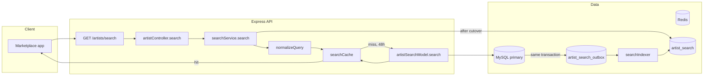
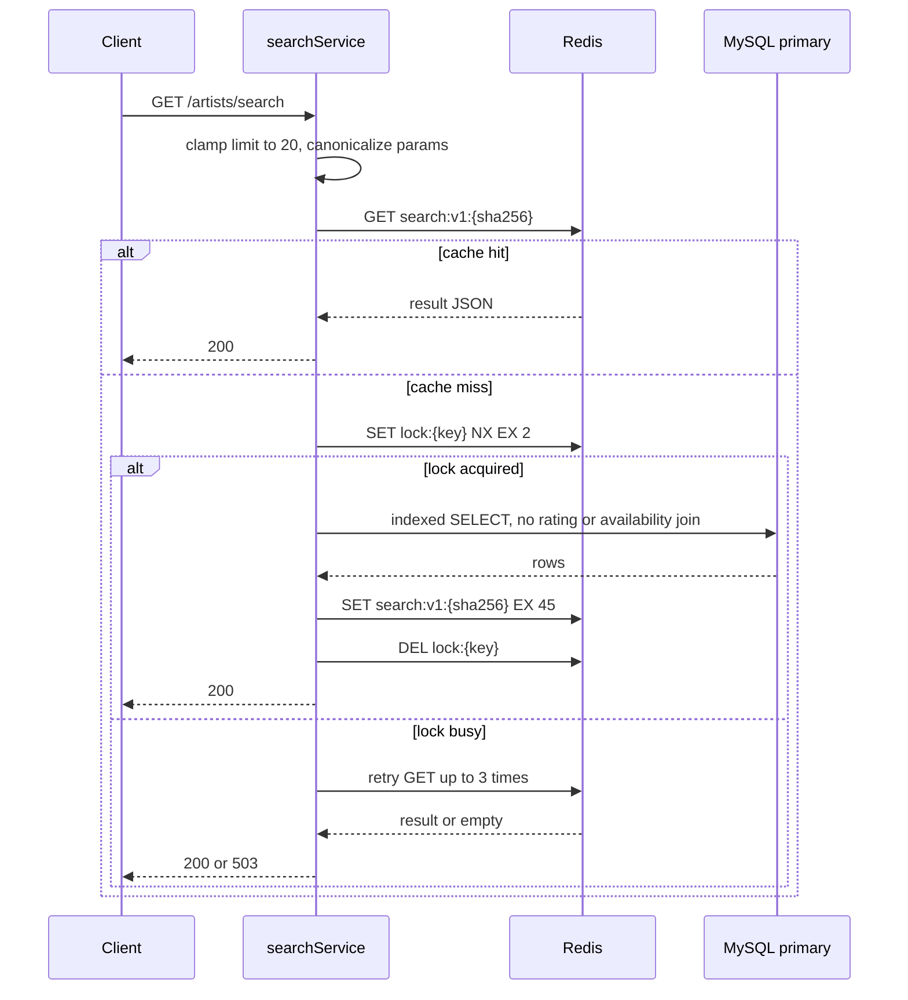
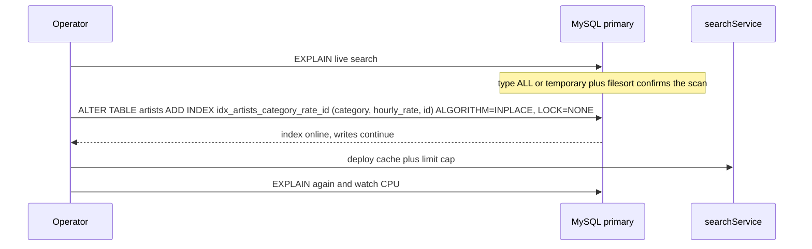
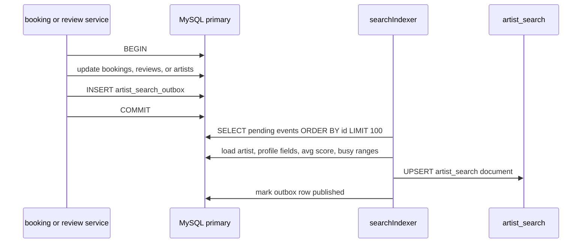
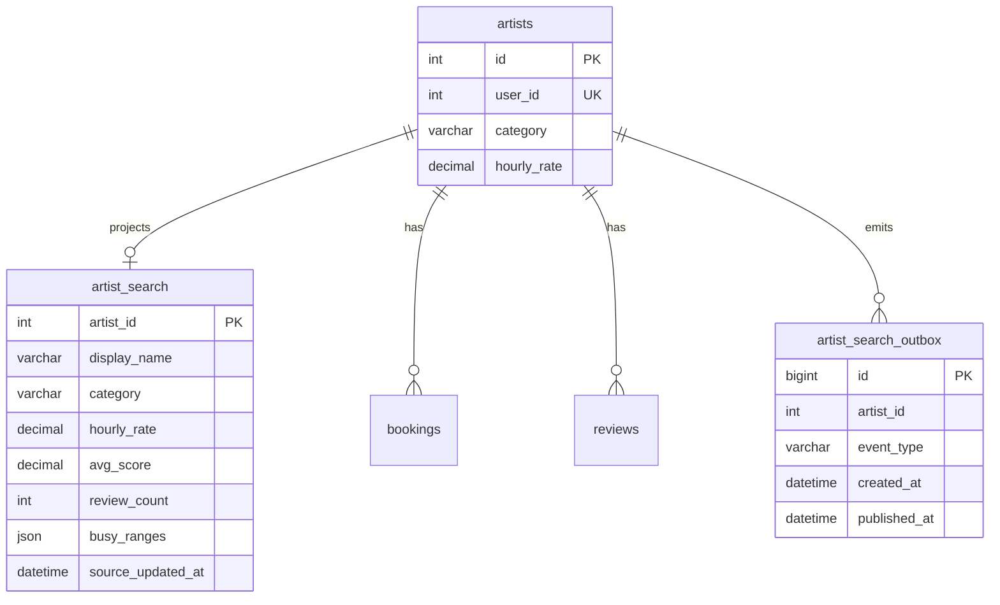

# Booking API — Artist Marketplace

A backend for booking artists: clients request a booking, the assigned artist moves it through a status lifecycle, and completed bookings can be reviewed. Built for the Senior Backend Engineer technical assignment.

Node.js + Express, MySQL (relational/transactional data) + MongoDB (flexible profile data), JWT auth, MVC-ish layering (`routes → controllers → services → models`).

## Tech stack

- **Runtime:** Node.js 18+, Express
- **Auth:** JWT (stateless — no sessions/cookies), bcrypt for password hashing
- **MySQL:** `users`, `artists`, `bookings`, `reviews` — relational, transactional data with real foreign keys
- **MongoDB:** `ArtistProfile` — bio, portfolio, tags, social links; flexible document data that doesn't fit a rigid row
- **Testing:** Jest + Supertest


## Project structure

```
src/
  app.js              Express app wiring (middleware, routes, error handling)
  server.js            Entry point — connects to MySQL/Mongo, then starts listening
  config/
    mysql.js           mysql2 connection pool
    mongo.js            mongoose connection
  db/
    schema.sql          MySQL DDL (tables, FKs, indexes)
    seed.js              Populates both databases with sample data
  models/
    mysql/              Raw SQL queries via mysql2 (no ORM) — one file per table
    mongo/
      ArtistProfile.js    Mongoose schema for artist bio/portfolio
  services/              Business logic: validation, the booking state machine, the
                          overlap check, review rules — framework-agnostic
  controllers/            Thin HTTP layer: pull params off req, call a service, shape the response
  routes/                 Express routers, wired to middleware + controllers
  middleware/
    auth.js               JWT verification + role gate
    errorHandler.js        Central error → response mapping
    asyncHandler.js         Wraps async controllers so thrown errors reach errorHandler
  utils/
    response.js            { success, data, error } envelope helpers
    AppError.js             Error type carrying an HTTP status
    jwt.js                  Sign/verify helpers
tests/
  booking.status.test.js   Required integration test (422 on invalid transition)
TASK3.md                  SQL & schema audit write-up
TASK4.md                  System design write-up
```


## Setup — running locally

**Requirements:** Node.js 18+, a local MySQL server, a local MongoDB server. No cloud account, no deployment.

```bash
# 1. Install dependencies
npm install

# 2. Configure environment
cp .env.example .env
# edit .env with your local MySQL credentials / Mongo URI if they differ from the defaults

# 3. Create the MySQL database (schema is applied automatically by seed)
mysql -u root -p -e "CREATE DATABASE IF NOT EXISTS booking_api"

# 4. Apply schema + seed sample data into MySQL and MongoDB
npm run seed

# 5. Start the server
npm start          # or: npm run dev (nodemon, auto-restart)

# 6. Run the test suite
npm test
```

`npm run seed` is idempotent — it (re)creates the schema with `CREATE TABLE IF NOT EXISTS`, truncates the MySQL tables, and reseeds both databases, so it's safe to run more than once. It prints sample login credentials (all seeded accounts use the password `password123`) and an artist ID you can use to try `GET /artists/:id/reviews` immediately.

## API reference

All responses use the envelope `{ success: boolean, data: object, error: string | null }`.

### `POST /auth/login`

```json
// Request
{ "email": "aanya@example.com", "password": "password123" }

// 200 response
{ "success": true, "data": { "token": "<jwt>", "user": { "id": 3, "name": "Aanya Verma", "email": "...", "role": "artist" } }, "error": null }
```

Returns `401` with a generic "Invalid email or password" for either a wrong email or a wrong password — the field that was wrong is never revealed.

### `POST /bookings` (client only, `Authorization: Bearer <token>`)

```json
// Request
{ "artist_id": 1, "event_start": "2026-11-01T10:00:00Z", "event_end": "2026-11-01T12:00:00Z", "notes": "Birthday portrait session" }
```

Rejects with `422` if `event_start` is in the past, or if the artist already has a *confirmed* booking overlapping the requested window. New bookings always start as `pending`.

### `PATCH /bookings/:id/status` (authenticated)

```json
{ "status": "confirmed" }
```

Enforces this state machine, returning `422` with a descriptive message for anything not listed:

```
pending  → confirmed    (artist)
pending  → cancelled    (artist or client)
confirmed → in_progress (artist)
confirmed → cancelled   (artist or client)
in_progress → completed (artist)
```

Trying to act on someone else's booking returns `403` (an authorization problem, distinct from an invalid state transition).

### `GET /artists/:id/reviews`

```
GET /artists/3/reviews?page=1&limit=10
```

Returns only reviews from completed bookings, newest first, with a summary:

```json
{
  "success": true,
  "data": {
    "artistId": "3", "page": 1, "limit": 10,
    "reviews": [ { "id": 1, "score": 5, "comment": "...", "created_at": "...", "client_id": 1 } ],
    "summary": { "totalCount": 6, "averageScore": 4.33, "distribution": { "1": 0, "2": 0, "3": 1, "4": 2, "5": 3 } }
  },
  "error": null
}
```


### Bonus: `GET /artists/leaderboard`

Implements the Task 3 leaderboard query directly (top 10 artists by average score over the last 90 days, minimum 5 reviews, tiebreak on completed booking count). See `TASK3.md` for the SQL and index reasoning.

### Bonus: `POST /bookings/:id/reviews` (client only)

```json
{ "score": 5, "comment": "Fantastic session!" }
```

Lets a client review their own booking once it's `completed` (one review per booking). See "Beyond the spec" below for why this was added.

## Decisions & trade-offs

- **MySQL vs. MongoDB split.** The assignment's stack reference lists `users`/`bookings`/`payments` for MySQL and "artist profiles, reviews" for MongoDB — but Task 3 then asks for a SQL leaderboard query and a *relational* schema audit of a `reviews` table with foreign keys to `bookings`. I resolved this by putting `reviews` in MySQL (it needs joins against `bookings` for the completed-only filter and against `artists`/`users` for the leaderboard — a relational fit) and using MongoDB only for `ArtistProfile` (bio, portfolio, tags, social links) — the part of "artist profile" that's genuinely document-shaped and doesn't need relational joins. This is noted here rather than left as a silent inconsistency.
- `artists` **is separate from** `users`**.** A `users` row is purely for authentication/role (client or artist). An `artists` row is the bookable business entity (category, hourly rate) and has a 1:1 `user_id` FK to `users`. `bookings.artist_id` references `artists.id`, not `users.id` directly — this mirrors how such systems are usually modeled in practice (a user *has* an artist profile, rather than *is* one).
- **403 vs. 422 on** `PATCH /bookings/:id/status`**.** The assignment's wording groups "a client can only cancel" under the same section as the state machine. I split these into two different, intentional response codes: wrong person touching someone else's booking → `403` (authorization), structurally invalid or role-disallowed transition (including a client attempting `confirm`/`in_progress`/`complete`) → `422` (business-rule violation), per the assignment's explicit instruction to use 422 for invalid transitions.
- **Reviews use MySQL, enforced via a join.** `GET /artists/:id/reviews` joins `reviews` to `bookings` and filters `status = 'completed'` at query time (rather than trusting a denormalized flag), so the "only completed bookings" rule holds even if a booking's status were ever changed after review.
- **Raw SQL, no ORM.** Given the assignment's emphasis on SQL ability, the MySQL models use `mysql2` directly with hand-written queries rather than an ORM/query builder, so the actual SQL is visible and auditable.


### Beyond the spec

The assignment specifies only a `GET` for reviews, with no way to create one. To make that endpoint actually testable end-to-end (rather than relying solely on seeded data), I added `POST /bookings/:id/reviews`, restricted to the booking's own client, only once the booking is `completed`, one review per booking. It's flagged clearly above and kept minimal — if the intent was really read-only / seed-only reviews, this endpoint can simply be ignored or removed from `src/routes/bookingRoutes.js`.

## System design — `GET /artists/search`

`GET /artists/search` stays on the API. Booking writes stay on the MySQL primary. The 48-hour change is an online index, a short Redis cache, and a hard page cap. The durable change is a denormalized search document, filled from an outbox, so search never aggregates reviews and bookings on the request path. The written diagnosis is in `TASK4.md`.




Search read, including the stampede lock. `limit` is clamped to 20 before the key is hashed, so a caller cannot change the cache entry or force a large scan.




The index matches the filters that survive the 48-hour cut: category, rate band, then `id` for a stable cursor. `ALGORITHM=INPLACE, LOCK=NONE` keeps writes running. `EXPLAIN` must show `ref` or `range` on `idx_artists_category_rate_id` before this is called done.




After cutover, a booking, review, profile, or rate change commits the row and an outbox event together. The indexer is the only writer to `artist_search`. Search reads that table. If the indexer is behind, search is stale for a few seconds and bookings are not.







`artist_search` is keyed by `artist_id` and indexed on `(category, hourly_rate, avg_score, artist_id)`. Rating and the busy window are columns on that row, computed when the outbox event is applied, so the request does no `AVG` and no booking join. Redis stays as a 45-second shield in front of that read. The primary is not a fallback under load: if `artist_search` is down, serve the last cached page or return 503.

